# User Guide

[1. Introduction](#1-introduction)  
[2. Quick Start](#2-quick-start)  
[3. Features](#3-features)  
&nbsp;&nbsp;&nbsp; [3.1 Viewing help: help](#31-viewing-help-help)  
&nbsp;&nbsp;&nbsp; [3.2 Adding task:](#32-adding-task)   
&nbsp;&nbsp;&nbsp;&nbsp;&nbsp;&nbsp;&nbsp;&nbsp;&nbsp;[Todo: todo](#todo-todo)  
&nbsp;&nbsp;&nbsp;&nbsp;&nbsp;&nbsp;&nbsp;&nbsp;&nbsp;[Deadline: deadline](#deadline-deadline)  
&nbsp;&nbsp;&nbsp;&nbsp;&nbsp;&nbsp;&nbsp;&nbsp;&nbsp;[Event: event](#event-event)  
&nbsp;&nbsp;&nbsp; [3.3 Listing all tasks: list](#33-listing-all-tasks-list)  
&nbsp;&nbsp;&nbsp; [3.4 Mark task as completed: done](#34-mark-task-as-completed-done)  
&nbsp;&nbsp;&nbsp; [3.5 Delete a task: delete](#35-delete-a-task-delete)  
&nbsp;&nbsp;&nbsp; [3.6 Locating all information using keyword: find](#36-locating-all-information-using-keyword-find)  
&nbsp;&nbsp;&nbsp; [3.7 Exit the program: bye](#37-exit-the-program-bye)  
[4. FAQ](#4faq)  
[5. Command Summary](#5command-summary)

## 1. Introduction  
Duke is for those who prefers to use a desktop application to manage the tasks they have in life.
   More importantly, Duke is optimized for people who preferred to use Command Line Interface (CLI).  
## 2. Quick Start  
   <br>
    1. Ensure you have Java 11 or above installed in your Computer.
     
   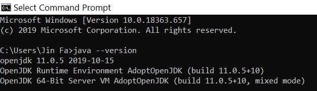  <br><br>
    2. Download the latest Duke.jar [here](https://github.com/jinfayap/duke/releases/download/v0.2/Duke.jar).  
    3. Copy the file to the folder you want to use as the home folder for your Duke.  
    4. Use Command Prompt or Integrated Development Environment's (IDE) terminal.
     Example: Intellij.   
     Type the command `java -jar <FILENAME>.jar` in the command line.  
  
   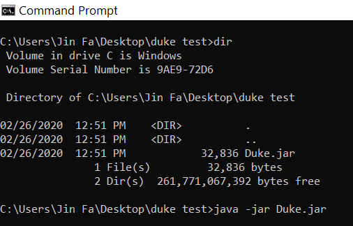 <br><br>
    5. Type the command in the command box and press Enter to execute it.
        e.g. typing help and pressing enter will display the help instructions
        
   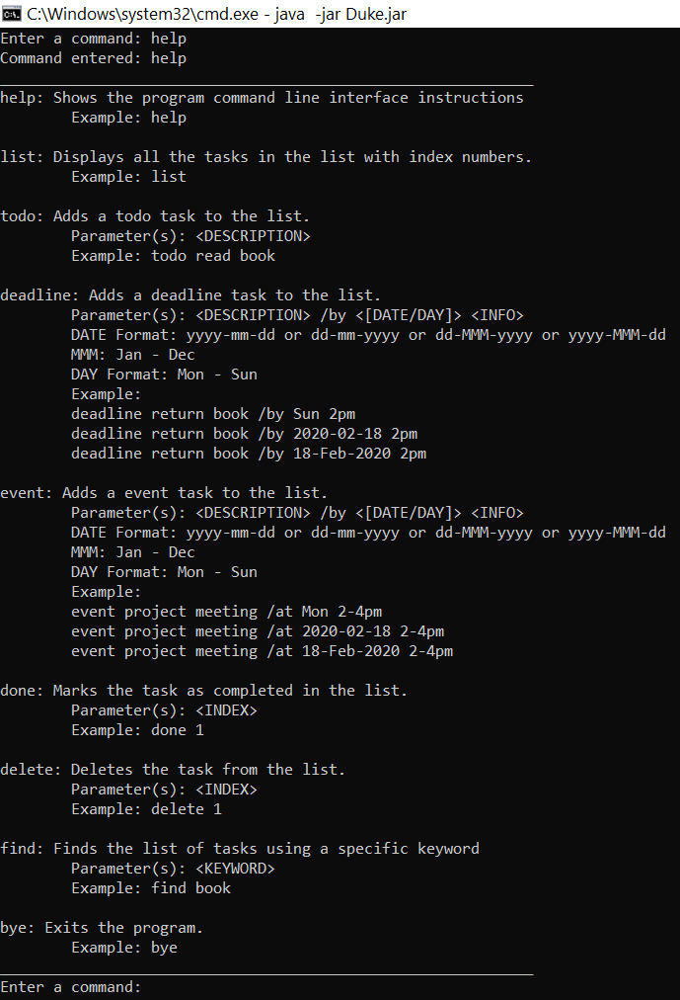<br><br>
    6. Refer to Section 3, for details of each command.

## 3. Features 
#### Command Format:    
```
- Words in UPPERCASE inside ANGULAR BRACKETS <>, are the PARAMETERS to be supplied by the user 
Example: find <KEYWORD>, KEYWORD is a parameter which can be used.
Example: find duke
- Items in SQUARE BRACKETS [] with a pipe |, [PARAMETER 1| PARAMETER 2], 
  specify user to input either ONE of the PARAMETERS
Example: <[DATE|DAY]> <INFO>. 
Command such as: deadline return book /by 2020-02-18 3pm or deadline return book /by Sun 3pm
```
## 3.1. Viewing help: help
`help` : Shows the program duke CLI instructions.  
`Format:` help  
`Example: help`  
## 3.2 Adding task  
#### Todo: todo  
`todo:` Adds a todo task to the list.  
`Format:` todo **\<DESCRIPTION\>**  
`Example: todo read book`

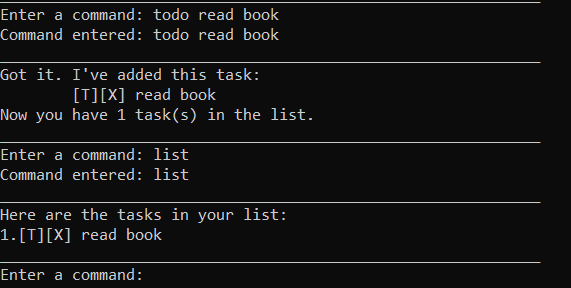
```
DEADLINE AND EVENT DATE|DAY

There are multiple ways you can add the date to deadline and task.
Here are THREE things you can take note of: 

    1. Some special characters also known as separator are used to separate the day, month and year.
        There are three separators you can use: 
            The basic format are as follows: 
            . (dot)
            / (forward slash)
            - (dash)
    2. Date Format:
        Year[Separator]Month[Separator]Day
            yyyy-mm-dd  == 2020-02-18
            yyyy-MMM-dd == 2020-Feb-18
        Day[Separator]Month[Separator]Year
            dd-mm-yyyy  == 18-02-2020
            dd-MMM-yyyy == 18-Feb-2020
    3. Day Format:
        Consist of 3 Letter: Mon, Tue, Wed, Thu, Fri, Sat, Sun
        Note: Capitalize the first letter of the Day            

CAUTIONARY:   
Inputing invalid date can throw an error - [Invalid] or set to the last date of the month 
```
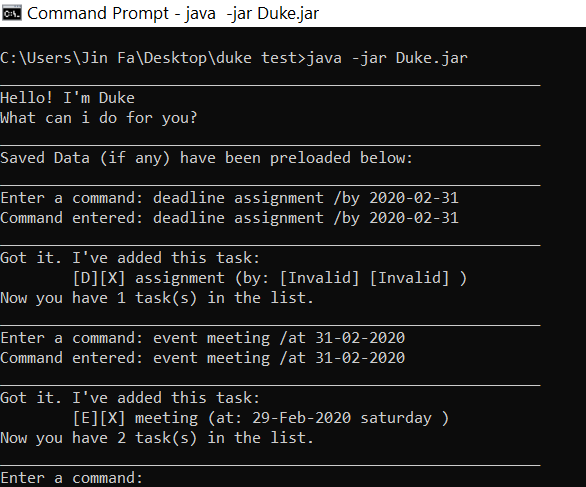 <br>
#### Deadline: deadline  
`deadline:` Adds a deadline task to the list.  
`Format:` deadline **\<DESCRIPTION\>** /by **\<\[DATE|DAY\]\>** **\<INFO\>**   
`Example: deadline return book /by Sun 2pm`  

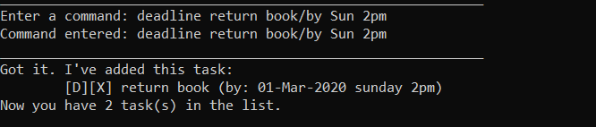

#### Event: event
`event:` Adds a event task to the list.  
`Format:` event **\<DESCRIPTION\>** /at **\<\[DATE|DAY\]\>** **\<INFO\>**   
`Example: event project meeting /at 2020-02-26 2-4pm NUS`  

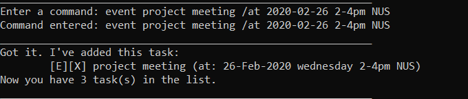

## 3.3 Listing all tasks: list  
`list:` Displays all the tasks in the list with index number.  
`Format:` list  
`Example: list`

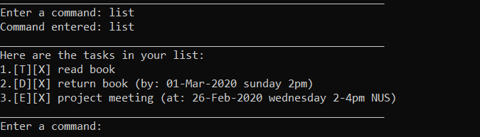

## 3.4 Mark task as completed: done  
`done:` Marks the task as completed in the list with index number.  
`Format:` done **\<INDEX\>**   
`Example: done 1`

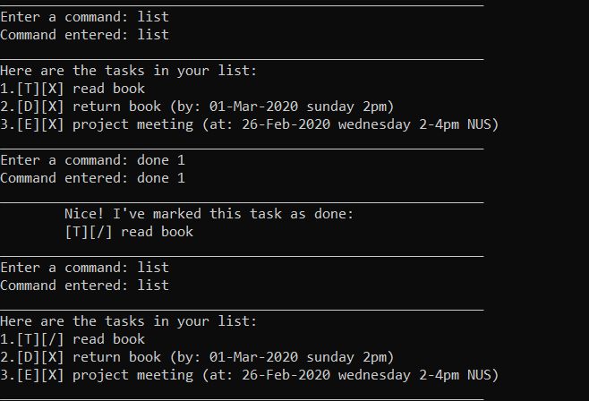

## 3.5 Delete a task: delete  
`delete:` Deletes a task from the list with index number.  
`Format:` delete **\<INDEX\>**   
`Example: delete 1`

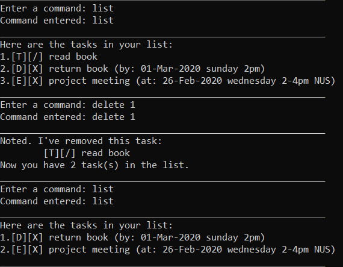

## 3.6 Locating all information using keyword: find  
`find:` Finds the list of information using specific keyword.   
`Format:` find **\<KEYWORD\>**   
`Example: find book`

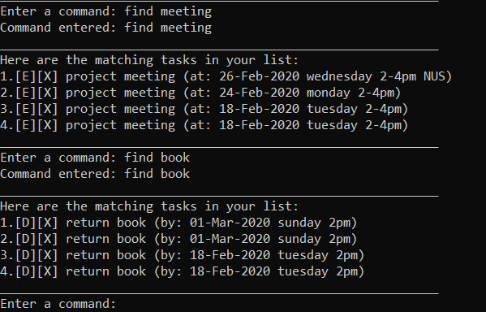

## 3.7 Exit the program: bye  
`bye:` Terminate the program.  
`Format:` bye  
`Example: bye`

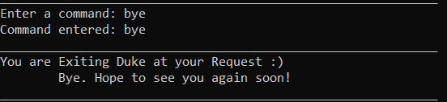

## 4.FAQ  
Q: Does the application save the data automatically?  
A: Yes, the application will save the tasks input by automatically creating a directory folder
`"data"` and txt file `"duke.txt"` 

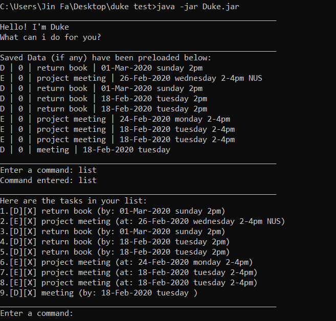
 
## 5.Command Summary  
```
Here is the short summary of the commands used in the duke application.  
Refer back to Section 3 for more information on the usage of the commands.
```
   - `Help` help  
   - `List` list  
   - `Todo` todo \<DESCRIPTION\>  
   - `Deadline` deadline \<DESCRIPTION\> /by \<\[DATE|DAY\]\> \<INFO\>  
   - `Event` event \<DESCRIPTION\> /at \<\[DATE|DAY\]\> \<INFO\>  
   - `Done` done \<INDEX\>  
   - `Delete` delete \<INDEX\>  
   - `Find` find \<KEYWORD\>  
   - `Exit` bye  
   