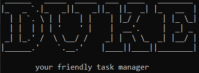

# Duke Task Manager - User Guide 
 
* [1. Introduction](#1-introduction)
* [2. Features](#2-features)
* [3. Command Format](#3-command-format)
* [4. Command Usage](#4-command-usage)
    + [4.1. Add tasks](#41-add-a-task)
        + [4.1.1 Todos](#411-todo---adds-a-todo-task)
        + [4.1.2 Events](#412-event---adds-an-event-task)
        + [4.1.3 Deadlines](#413-deadline---adds-a-deadline-task)
    + [4.2. Mark task as done](#42-done---mark-task-as-done)
    + [4.3. Display all tasks](#43-list---displays-all-tasks-in-list)
    + [4.4. Find task by keyword](#44-find---find-tasks-that-match-keyword)
    + [4.5. Delete tasks](#45-delete---deletes-task-from-list)
    + [4.6. Clear all tasks](#46-clear---clears-all-existing-tasks)
    + [4.7. Viewing Help](#47-help---displays-a-help-list)
    + [4.8. Exiting Duke](#48-bye---exits-the-program)
- [5. Command Summary](#5-command-summary)       
     
 
## 1. Introduction
 
Duke is a CLI-based application that helps you keep track of your tasks. 
This application is for people who are *able to type fast* and *prefer keep tracking of tasks on their desktops using a Command-Line Interface.*
 
&nbsp;
 
## 2. Features

#### Keep track of your tasks
Duke helps you to keep track of various kinds of tasks (Todos, Events and Deadlines) and display them.

#### Marking your tasks as done
Duke can help you mark your tasks as complete through the `done` Command so that you can keep track of the completion status of various tasks.

#### View all your tasks
The `list` command that Duke provides can display all the tasks that you are currently tracking.

#### Auto-save and store your tasks
Duke has an auto-save feature which stores your tasks every time you add or modify them. 
With this feature, your tasks will be saved every time you leave the application. They will still be there when you come back subsequently.

&nbsp;

## 3. Command Format
Words enclosed within angle brackets `<>` are the parameters to be supplied by the user. Other keywords stated are compulsory and they should be included.

For example, in `event <Task Description> /<Remark>`, `event` is the command keyword that adds an Event task. `<Task Description>` is the description of the event to be supplied by you. `<Remark>` represents additional information about the event to be added, like the date and time.

A valid input would be `event Project meeting /Mon 4pm`.

&nbsp;

## 4. Command Usage
 
### 4.1 Add a task
Duke allows you to add 3 different types of tasks: todo, deadline and event. Refer to the subheaders below for more information on each of the task subtypes.
 
 
#### 4.1.1 `todo` - Adds a todo task
 
This command adds a todo task to the current task list. Todos contain a description only.
 
Format: `todo <Description>`
 
Example of usage:`todo read book` - Adds a todo task with description "read book" to the list
 
 
Expected outcome:
 
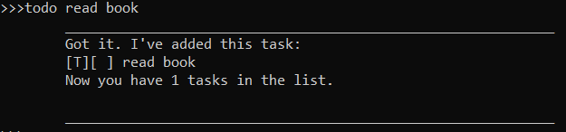
 
&nbsp;

#### 4.1.2 `event` - Adds an event task
 
This command adds an event task to the current task list. Events contain a description and a remark (usually the event date and time).
 
Format:
 `event <Description> /<Remark>`
 
- Adds an event and its' event time and/or place to the list
 
- Text that follows the **first instance of "_/"** ( _ denoting a whitespace) will be placed in the remarks section of the event.
 
- Valid `<Remark>` formats include:
    + Any String value (e.g. **Mon 4pm**) 

Example of usage:
`event Justin's 21st /Justin's house Sat 8pm`
 
Expected outcome:
 
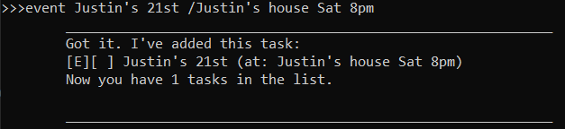
 
&nbsp;
 
#### 4.1.3 `deadline` - Adds a deadline task
 
This command adds a deadline task to the current task list. Like events, deadlines contain a description and a remark (usually the event date and time).
 
Format:
 `deadline <Description> /<Remark>`
 
- Adds a deadline and its' event time and/or place to the list
 
- Text that follows the **first instance of "_/"** ( _ denoting a whitespace) will be placed in the remarks section of the event.
 
- Valid `<Remark>` formats include:
    + Any String value (e.g. **Mon 4pm**) 
 
Example of usage:
`deadline CS2113 iP submission /2nd Mar 12pm`
 
 
Expected outcome:
 
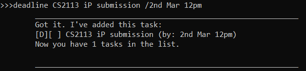
 
&nbsp;
 
### 4.2 `done` - Mark task as done

This command marks a task as completed. When executed, the task completion box of the specified task changes `[ ]` (not completed) to `[/]` (completed).
 
Format:
 `done <Index>`
 

 - Deletes the task item at the specified index.
  
 - `<Index>` refers to the index number of a specific task in the displayed task list.
  
 - The index must be a positive integer 1, 2, 3, etc.

Example of usage:
`done 1`

Assuming this is our existing list:

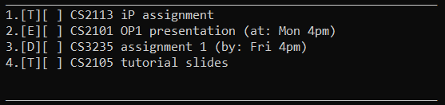
 
Expected outcome:
 
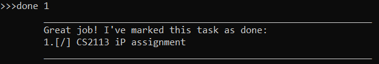
 
&nbsp;
 
 
### 4.3 `list` - Displays all tasks in list

This command displays all existing tasks in an easy-to-read format, including the task type notation `[T/E/D]`, completion status and task details.
 
Format:
 `list`
 

Example of usage:
`list`
 
Expected outcome (if task list is non-empty):
 
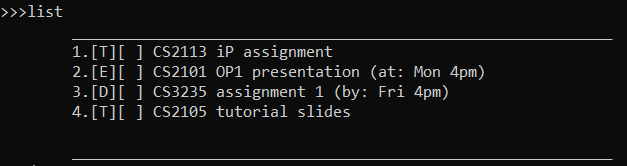

Expected outcome (if task list is empty):
 
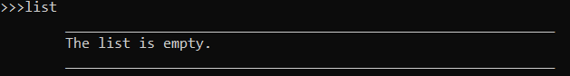
 
&nbsp;
 
### 4.4 `find` - Find tasks that match keyword

This command, given a search keyword, shows you a sub-list of all Tasks containing that keyword.

**NOTE:** The index of the tasks in this sub-list follows it's index in the original task list.

Format:
 `find <Keyword>`
 
- `<Keyword>` is the term that will be searched across task description and remark fields.
- Tasks with description/remarks that contain the `<Keyword>` are displayed. 
 
 
Example of usage:
`find assignment`

Assuming this is our existing list:

 
Expected outcome:
 
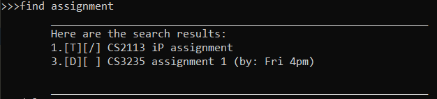

Expected outcome (if no matching results):

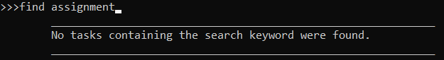
 
&nbsp;
 
### 4.5 `delete` - Deletes task from list
This command removes a specified task from the list of existing tasks.
 
Format:
 `delete <Index>`
 
- Deletes the task at the specified index.
 
 - `<Index>` refers to the index number of a specific task in the displayed task list.
  
 - The index must be a positive integer 1, 2, 3, etc.
 
Example of usage:
`delete 1`

Assuming this is our existing list:

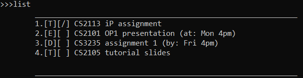
 
Expected outcome:
 
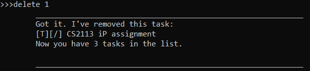

The resulting list:

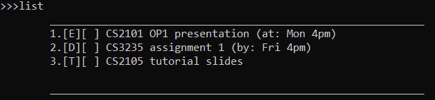
 
&nbsp;

### 4.6 `clear` - clears all existing tasks
This command removes all tasks from the task list.
 
Format:
 `clear`
 
 
Example of usage:
`clear`

Assuming this is our existing list:

 
Expected outcome:
 
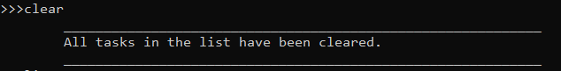

The resulting list:

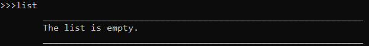
 
&nbsp;

### 4.7 `help` - Displays a help list
This command contains help information about all accepted commands.
 
Format:
 `help`
 
 
Example of usage:
`help`
 
Expected outcome:
 
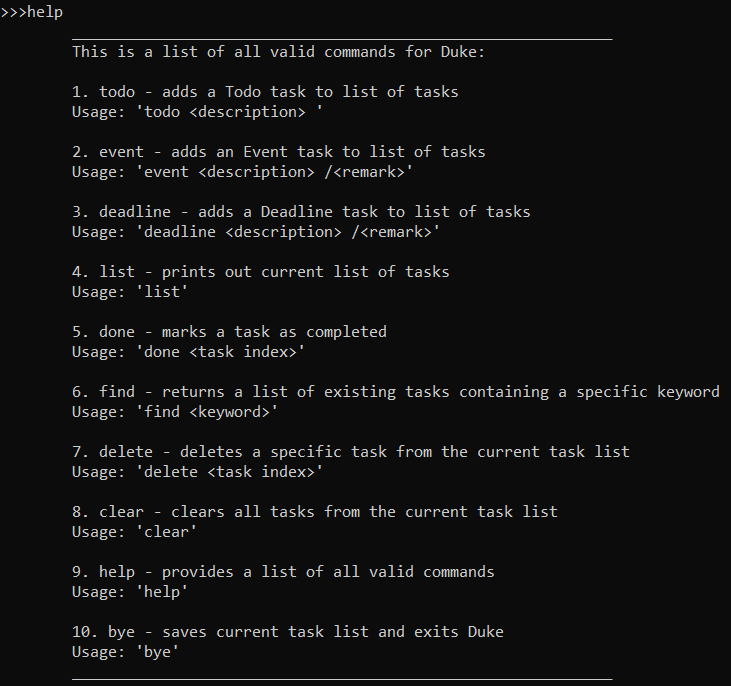
 
&nbsp;
 
 
### 4.8 `bye` - Exits the program
Saves the task list to a local storage file in the computer and exits program.
 
 
Format:
 `bye`
 
 
Example of usage:
`bye`
 
Expected outcome:
 
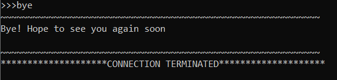
 
&nbsp;
 
## 5. Command Summary 
 
* *Todo* : `todo <Description>` \
e.g. `todo read book`

* *Event* : `event <Description> /<Remark>` \
e.g. `event Justin's 21st /Justin's house Sat 8pm`
 
 
* *Deadline* : `deadline <Description> /<Remark>` \
e.g. `deadline CS2113 iP submission /2nd Mar 12pm`
 
* *Mark as Done* : `done <Index>` \
e.g. `done 1`
 
* *List* : `list` 
 
* *Find* : `find <Keyword>` \
e.g. `find book`
 
* *Delete* : `delete <Index>` \
e.g. `delete 1`
 
* *Clear* : `clear`
 
* *Help* : `help`
 
* *Exit* : `bye`
