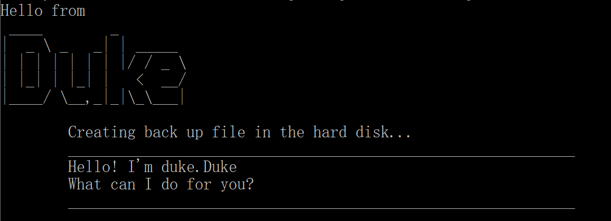

# Duke - User Guide
By: `WANG JINGTAN` Since: `Jan 2020`
* [Introduction](#1-introduction)
* [Quick Start](#2-quick-start)
* [Features](#3-features)
  * [Viewing help](#31-viewing-help--help)
  * [Adding tasks](#32-adding-tasks)
  * [Checking data](#33-checking-date-check)
  * [Finding a task](#34-finding-a-task-find)
  * [Having done a task](#35-having-done-a-task-done)
  * [Deleting a task](#36-deleting-a-task-delete)
  * [Listing all tasks](#37-listing-all-tasks-list)
  * [Exiting duke](#38-exiting-duke-bye)
  * [Saving the tasks](#39-saving-the-tasks)
* [FAQ](#4-faq)
* [Command Summary](#5-command-summary)

## 1. Introduction
Duke is for those who wants to **record daily life tasks on desktop**. 
It is a Personal Assistant Chatbot that helps a person to keep track of various things.
As a **Command Line Interface (CLI) application**, it is suitable for those who type fast. 

## 2. Quick Start
1. Ensure you have JAVA '11' or above installed in your Computer.
2. Download the latest duke.jar [here](https://github.com/JTWang2000/duke).
3. Copy the file to an empty folder where you want to use as the home folder for your Duke.
4. Open a command window in that folder.
5. Run the command `java -jar duke.jar`. The CLI should appear in a few seconds.

6. Some example commands you can try:
    * `help` : shows all the command you can try
    * `todo clean the house`: add `clean the house` to duke
    * `bye` : exit the app
7. Refer to [Section 3. Features](#3-features) for details of each command. 
Description of feature.

## 3. Features
### 3.1 Viewing help : `help`
Format: `help`

### 3.2 Adding tasks:
All the tasks are not done when they are first created.
##### 3.2.1 Adding to do: `todo`
Adds a task that needs to be done

Format: `todo TASK`

Examples: 
* `todo Clean the house`
* `todo laundry`
##### 3.2.3 Adding deadline: `deadline`
Adds a task that has deadline

Format: `deadline TASK /by TIME`

*The `TIME` is suggested to follow format:`yyyy-mm-dd`*

Examples:
* `deadline assignment /by 2020-03-01`
* `deadline coding exercise /by tomorrow midnight`
##### 3.2.3 Adding event : `event`
Adds a task that happens on a specific day

Format: `event TASK /at TIME`

*The `TIME` is suggested to follow format:`yyyy-mm-dd`*

Examples:
* `event read book /at 2020-03-06`
* `event group meeting /at 6pm`

### 3.3 Checking date: `check`
Checks deadline/event occurs on that day

Format: `check yyyy-mm-dd`

Example: `check 2020-03-01`

### 3.4 Finding a task: `find`
Finds a task by its keyword in the task description

Format: `find KEYWORD`

Example: `find book`

### 3.5 Having done a task: `done`
Marks a task as done.

Format: `done INDEX`

*INDEX is a number starts from 1*

### 3.6 Deleting a task: `delete`
Deletes a task.

Format: `delete INDEX`

*INDEX is a number starts from 1*

### 3.7 Listing all tasks: `list`
Lists all the tasks.

Format: `list`

### 3.8 Exiting duke: `bye`
Exits the app.

Format: `bye`

### 3.9 Saving the tasks
Tasks in duke are saved in the hard disk automatically. You can find all the existing tasks in the data folder in the Duke folder. 

## 4. FAQ
**Q**: How do I transfer my data to another Computer?

**A**: Install the app in the other computer and copy the data folder in previous Duke folder to the new Duke Folder.

**Q**: What if I accidentally input something wrong?

**A**: Duke can handle such error. No worry.

## 5. Command Summary
* **Help** `help`
* **Add** 
`todo TASK`
 `deadline TASK /by yyyy-mm-dd` 
 `event TASK /at yyyy-mm-dd`
* **Check** `check yyyy-mm-dd`
* **Find** `find KEYWORD`
* **Done** `done INDEX`
* **Delete** `delete INDEX`
* **List** `list`
* **Exit** `bye`

