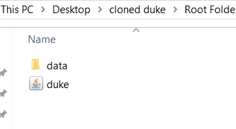

# User Guide

## Table of Contents
1. Introduction
1. Quick Start
1. FAQ
1. Features
1. Command Summary

## Introduction

*Nini* is a Task Manager built upon Duke's starter 
code that assists Users with their lists of tasks. 
User can use *Nini* to manage a list of Todos or 
Events or Deadlines. For more details of how *Nini*
manages the list of Tasks, refer to the *Features* section below.

## Quick Start

* Ensure you have at least Java 11 or above to run the Jar file.
* Ensure you have downloaded the Jar file successfully.
	* (Click [here](https://github.com/NizarMohd/duke/releases/download/A-Jar-Test/duke.jar) for Jar file)
* Navigate through command prompt to the directory that the Jar 
  file has been downloaded into.
* Type {java -jar duke.jar} to start using *Nini*

## FAQ 

1. __The software says I have a missing duke file and it could not create one for me__  
	Please create a text file called 'duke.txt' file inside a folder called 'data'.
	Ensure that the data folder is under the same directory as the Jar file.  
	Example:  
	

## Features 

###  Feature 1 
User can _add_ Tasks. There exists 
three different Tasks: 
* Todo
* Event 
* Deadline. 

Note: Event and Deadline Tasks have an additional
aspect in which timing is also stored on top of 
Task description. Timing has to be input as follows:
`yyyy-MM-dd HH:mm`

When a Task is added, *Nini* will
inform the User accordingly.

### Feature 2
User can mark Tasks as _done_. 

User must indicate the index in the Task List
that the Task is assigned to. 

When a task is marked as _done_,
*Nini* will inform the User and update
the check box with a check mark.

User also has the option to mark all as done. 
In which *Nini* will show the user that all Tasks
has its check box converted into a check mark.
      
### Feature 3 
User can _delete_ Tasks.

User must indicate the index in the Task List
that the Task is assigned to. 

When a Task is deleted, *Nini* will update
the User on the specific Task deleted. 

User also has the option to delete all Tasks.

In doing so, *Nini* will inform the User that all
Tasks have been deleted.

### Feature 4
User can list Tasks.

*Nini* will inform User of the all the 
Tasks currently stored in his Task List.

Tasks with a check mark indicates Tasks that
are deemed as completed by User while Tasks
with a ballot are Tasks that are not yet 
deemed as complete by the User.

### Feature 5 
User can find Tasks

*Nini* will search for Tasks that matches
the key entered by the User.

### Feature 6
User can ask for help from *Nini*

In response, *Nini* will list out a list
of commands that *Nini* is programmed to 
do. 

##  Usage

### `Todo` - Adds a Task of type Todo.

To add a Todo Task, type {todo} {task description} 

Example of usage: 

    todo read books

Expected outcome:

    __________________________________________________________
     Got it. I've added this task:
      [T][✘] read books
     Now you have 1 tasks in the list.
    __________________________________________________________

### `Event` - Adds a Task of type Event.

To add an Event Task, type {event} {task description} {/} {timing}

Example of usage: 

     event celebrate birthday / 2020-02-16 14:00 

Expected outcome:

	__________________________________________________________
	 Got it. I've added this task:
	   [E][✘] celebrate birthday (at: SUNDAY, 16 FEBRUARY 2020 14:00 )
	 Now you have 2 tasks in the list.
	__________________________________________________________

### `Deadline` - Adds a Task of type Deadline.

To add a Deadline Task, type {deadline} {task Description} {/} {timing}

Example of usage: 

     deadline finish homework / 2020-02-18 09:00

Expected outcome:

	__________________________________________________________
	 Got it. I've added this task:
	   [D][✘] finish homework (by: TUESDAY, 18 FEBRUARY 2020 9:00 )
	 Now you have 1 tasks in the list.
	__________________________________________________________ 

### `Done` - Marks a specific Task as completed.

To mark a Task as completed, type {done} {task index}

Example of usage: 

    done 1

Expected outcome:

    __________________________________________________________  
	   Nice! I've marked this task as done:  
	    [T][✓] read books  
    __________________________________________________________  
    
To mark _ALL_ Tasks as completed, type {done} {all}

Example of usage: 

    done all

Expected outcome:

    __________________________________________________________  
    All tasks have been marked as done!
    1.[T][✓] read books  
    2.[E][✓] celebrate birthday (at: SUNDAY, 16 FEBRUARY 2020 14:00 )  
    3.[D][✓] finish homework (by: TUESDAY, 18 FEBRUARY 2020 9:00 )  
    __________________________________________________________  

### `Delete` - Delete Tasks from Task List.

To delete Tasks from Task List, type {delete} {task index}

Example of usage: 

    delete 1

Expected outcome:

    __________________________________________________________
     Noted. I've removed this task: 
       [T][✓] read books
     Now you have 3 tasks in the list.
    __________________________________________________________
    
To delete _ALL_ Tasks from the Task List, type {delete} {all}
Note: when using this command, *Nini* will prompt the User to
confirm if they intend on deleteing _ALL_ Tasks. User is then 
required to type Y for Yes or N for No.

Example of usage: 
    
    delete all
  
Expected outcome:

    __________________________________________________________
     Are you sure that you want ALL tasks to be deleted?
     Type Y for Yes and N for No
    __________________________________________________________
  
    Y _(USER INPUT)_
    __________________________________________________________
       All tasks have been deleted!
    __________________________________________________________
  
### `List` - Lists all currently available Tasks in the Task List.
  
To retrieve the current list of Tasks, type {list}
  
Example of usage:
  
     List
  
Expected outcome:

    __________________________________________________________
     Here are the tasks in your list:
	 1.[T][✓] read books  
	 2.[E][✓] celebrate birthday (at: SUNDAY, 16 FEBRUARY 2020 14:00 )  
	 3.[D][✓] finish homework (by: TUESDAY, 18 FEBRUARY 2020 9:00 ) 
    __________________________________________________________

### `Find` - Finds a list Tasks that matches the search key.

Example of usage:

    Find books

Expected outcome: 

    __________________________________________________________
     Here are the matching tasks in your list!
     1.[T][✘] read books
    __________________________________________________________
    
### `Help`- Lists commands that can be carried out by *Nini*

Example of usage:

    help
 
Expected outcome: 

	__________________________________________________________
	 Below would be a list of commands that you will find useful!
	 1. [Todo] - Adds a Task of type Todo.
	    To add a Todo Task, type {todo} {task description}
	 2. [Event] - Adds a Task of type Event.
	    To add an Event Task, type {event} {task description} {/} {timing}
	 3. [Deadline] - Adds a Task of type Deadline.
	    To add a Deadline Task, type {event} {task description} {/} {timing}
	 4. [Done] - Marks a specific Task as completed.
	    To mark a Task as completed, type {done} {task index}
	    To mark ALL Tasks as completed, type {done} {all}
	 5. [Delete] - Delete Tasks from Task List.
	    To delete Tasks from Task List, type {delete} {task index}
	    To delete ALL Tasks from the Task List, type {delete} {all}
	    ***Note: when using this command, Nini will prompt the User to
	    confirm if they intend on deleting _ALL_ Tasks. User is then
	    required to type Y for Yes or N for No.***
	 6. [List] - Lists all currently available Tasks in the Task List.
	    To retrieve the current list of Tasks, type {list}
	 7. [Find] - Finds a list Tasks that matches the search key.
	    To find a list of matching Tasks, type {find}
	__________________________________________________________

    
