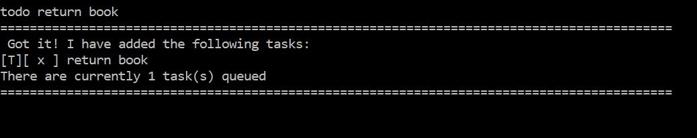
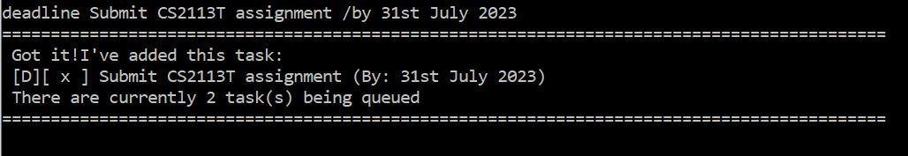
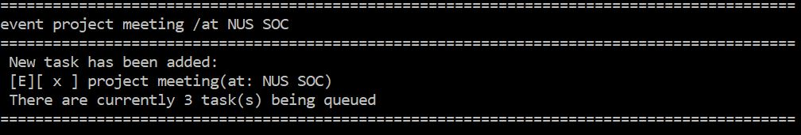
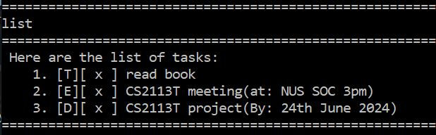
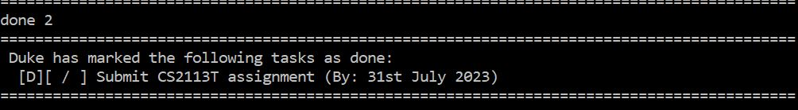
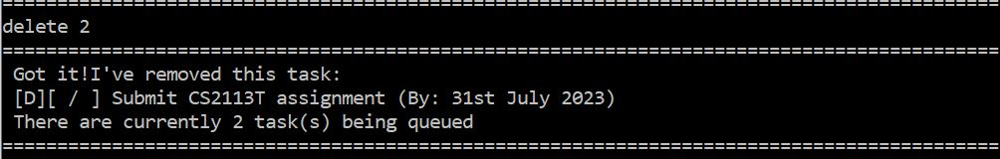
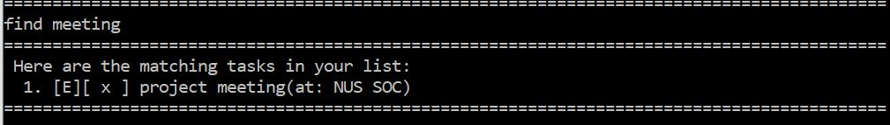
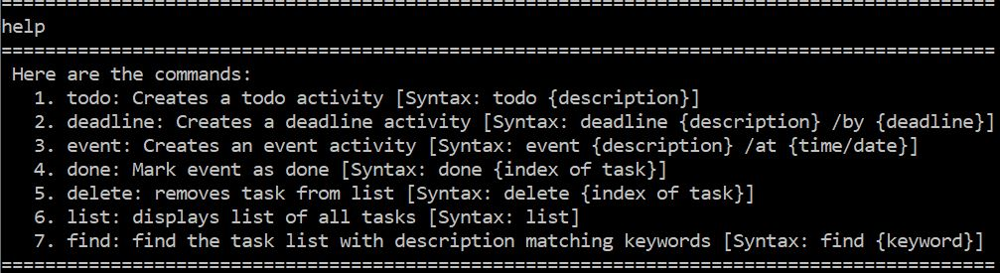
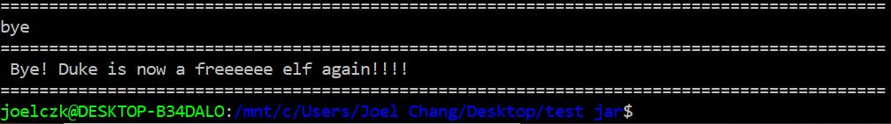

# duke - User Guide
duke is a personal task tracker that stores and records your to-dos, deadlines and events.This user guide demonstrates
how to set up duke and how use the basic features of duke.

## Setting Up
1. Extract the jar folder into an empty folder
2. Enter your preferred terminal and move to the location of the folder
3. Run the Command-Line interface(CLI) with `java -jar duke.jar` in your terminal


### Features
+ [ToDo](#todo)
+ [Deadline](#deadline)
+ [Event](#event)
+ [List](#list) 
+ [Done](#done)
+ [Delete](#delete)
+ [Find](#find)
+ [Help](#help)
+ [Bye](#bye)

### Command Format
Words enclosed by `{` and `}` are parameters that are supplied by you.

### Task types
```
To-Dos (Represented by [T])
Event (Represented by [E])
Deadline (Represented by [D])
```
&nbsp;
&nbsp;
&nbsp;
## Usage
&nbsp;
&nbsp;
### <a id="todo"></a> `todo` - Adds a todo task to your list

Syntax: 

`todo {TASK DESCRIPTION}`

Example of usage: 

`todo return book`

Expected outcome:


&nbsp;
&nbsp;
### <a id="deadline"></a> `deadline` - Adds a deadline task to your list

Syntax:

`deadline {TASK DESCRIPTION} /by {DEADLINE}`

Example of usage: 

`deadline submit assignment /by 20th Jan 2019`

Expected outcome:


&nbsp;
&nbsp;
&nbsp;
### <a id="event"></a> `event` - Adds an Event task to your list

Syntax: 

`event {TASK DESCRIPTION} /at {LOCATION/TIME}`

Example of usage: 

`event project meeting /at NUS SOC 2pm`

Expected outcome:


&nbsp;
&nbsp;
&nbsp;
### <a id="list"></a> `list` - Displays all your tasks

Syntax: 

`list`

Expected outcome:


&nbsp;
&nbsp;
&nbsp;
### <a id="done"></a> `done` - Marks task as completed based on specified index

Syntax: 

`done {TASK INDEX}`

Example of usage: 

`done 3`

Expected outcome:


&nbsp;
&nbsp;
&nbsp;
### <a id="delete"></a> `delete` - Deletes task from list based on specified index

Syntax: 

`delete {TASK INDEX}`

Example of usage: 

`delete 1`

Expected outcome:


&nbsp;
&nbsp;
&nbsp;
### <a id="find"></a> `find` - Finds task from list based on search query

Syntax: 

`find {SEARCH QUERY}`

Example of usage: 

`find assignment`

Expected outcome:


&nbsp;
&nbsp;
&nbsp;
### <a id="help"></a> `help` - Displays all the commands

Syntax: 

`help`


Expected outcome:


&nbsp;
&nbsp;
&nbsp;
### <a id="bye"></a> `bye` - Terminates program

Syntax: 

`bye`

Expected outcome:


