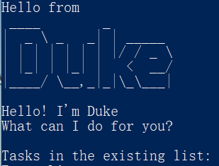

# User Guide for Duke
Author: **Wu Sibing** 
Since: **Feb 2020**

1. [Introduction](#1-introduction) 
2. [Quick Start](#2-quick-start) 
3. [Features](#3-features) 
    3.1. [Viewing help: `help`](#31-viewing-help-help) 
    3.2. [Adding a "Todo" task: `todo`](#32-adding-a-todo-task-todo) 
    3.3. [Adding a "Deadline" task: `deadline`](#33-adding-a-deadline-task-deadline) 
    3.4. [Adding a "Event" task: `event`](#34-adding-a-event-task-event) 
    3.5. [Listing all tasks: `list`](#35-listing-all-tasks-list) 
    3.6. [Marking a task as done: `done`](#36-marking-a-task-as-done-done) 
    3.7. [Deleting a task: `delete`](#37-deleting-a-task-delete) 
    3.8. [Checking tasks on a date: `check`](#38-checking-tasks-on-a-date-check) 
    3.9. [Finding tasks via keyword: `find`](#39-finding-tasks-via-keyword-find) 
    3.10. [Clearing all entries: `clear`](#310-clearing-all-entries-clear) 
    3.11. [Exiting the program: `bye`](#311-exiting-the-program-bye) 
    3.12. [Saving the data](#312-saving-the-data) 
4. [FAQ](#4-faq) 
5. [Command Summary](#5-command-summary) 

## 1. Introduction
Duke is for those who want to record their "todo list". It allows user to add in, update, and keep track of their own daily tasks.
Duke adopts Command Line Interface (CLI).
If you can type fast, AB3 can get your contact management tasks done faster than traditional GUI apps. Interested? Jump to the [Section 2, “Quick Start”](#2-quick-start) to get started. Enjoy!

## 2. Quick Start
1. Ensure you have Java **11** or above installed in your Computer.
2. Download the latest **duke.jar** [here](https://github.com/SibingWu/duke/releases).
3. Copy the file to the folder you want to use as the home folder for your Duke.
4. Open a Terminal in that folder.
5. Run the command `java -jar duke.jar`. The CLI should appear in a few seconds. It should be a welcome page with existing task list. 

6. Type the command in the command box and press Enter to execute it. 
e.g. typing `help` and pressing <kbd>Enter</kbd> will open the help window.
7. Some example commands you can try: 
   - `todo read book`: add the task "read book" into the task list
   - `list`: list all the tasks in the task list
   - `bye`: exit the Duke program
8. Refer to [Section 3, “Features”](#3-features) for details of each command.

## 3. Features
The word with UPPER_CASE: parameter. 
The date format: yyyy-mm-dd. 
### 3.1. Viewing help: `help`
Format: `help`
### 3.2. Adding a "Todo" task: `todo`
Adds an ordinary task to the task list. 
Format: `todo TASK` 
*TASK can be any content.* 
Examples: 
* `todo read book`
* `todo join sports club` 

### 3.3. Adding a "Deadline" task: `deadline`
Adds a task with a deadline to the task list. 
Format: `deadline TASK /by yyyy-mm-dd` 
*TASK can be any content.* 
Reminder: The deadline date format must be **yyyy-mm-dd**. 
Examples: 
* `deadline return book /by 2020-06-06`
* `deadline CS2113 iP project /by 2020-03-01` 

### 3.4. Adding a "Event" task: `event`
Adds an event task on a specific date to the task list. 
Format: `event TASK /at yyyy-mm-dd` 
*TASK can be any content.* 
Reminder: The deadline date format must be **yyyy-mm-dd**. 
Examples: 
* `event project meeting /at 2020-03-01` 

### 3.5. Listing all tasks: `list`
Shows a list of all tasks in the Duke task list. 
Format: `list` 
### 3.6. Marking a task as done: `done`
Marks a task as done. 
Format: `done TASK_NUMBER` 
*TASK_NUMBER is the number of that task in the task list. It is an integer.*
Examples: 
* `done 1`
* `done 4` 

### 3.7. Deleting a task: `delete`
Deletes the specified task from the Duke task list. 
Format: `delete TASK_NUMBER` 
*TASK_NUMBER is the number of that task in the task list. It is an integer.*
Example: 
* `delete 1`
* `delete 4` 

### 3.8. Checking tasks on a date: `check`
Displays all the tasks on a specified date. 
Format: `check /on yyyy-mm-dd` 
Reminder: The deadline date format must be **yyyy-mm-dd**. 
Example: 
* `check /on 2020-03-03` 

### 3.9. Finding tasks via keyword: `find`
Finds tasks whose names contain the given keyword. 
Format: `find KEYWORD`
Example:   
* `find book`
* `find basketball` 

### 3.10. Clearing all entries: `clear`
Clears all entries from the Duke task list. 
Format: `clear`
### 3.11. Exiting the program: `bye`
Exit the Duke program. 
Format: `bye` 
### 3.12. Saving the data
Task list data are saved in the hard disk automatically after any command that changes the task list. 
There is no need to save manually.

## 4. FAQ
Q: How do I transfer my data to another Computer? 
A:  
1. Install the **duke.jar** in the other computer; 
2. Copy the **data** folder in the previous Duke folder to the new Duke folder.

## 5. Command Summary
* Help `help`
* Add
  - `todo TASK`
  - `deadline TASK /by yyyy-mm-dd`
  - `event TASK /by yyyy-mm-dd`
* List `list`
* Done `done TASK_NUMBER`
* Delete `delete TASK_NUMBER`
* Search
  - `check /on yyyy-mm-dd`
  - `find KEYWORD`
* Clear `clear`
* Exit `bye`
