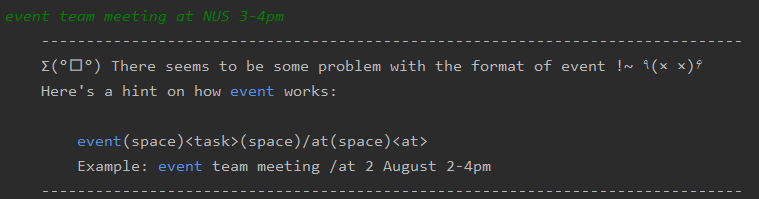
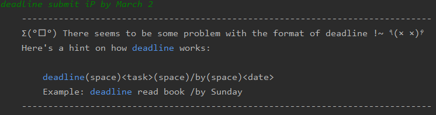
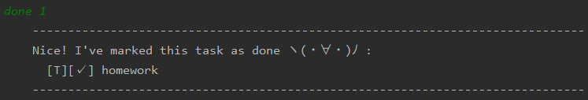

# User Guide

## Features 

### View help
Shows the entire command list of Duke. 

### Add todo task
Adds a todo task.
 
### Add event task
Adds a event task.
 
### Add deadline task
Adds a deadline task.
 
### View list
Shows a list of task that has been added previously.
 
### Mark as done
Mark a specific task as done. 
 
### Find specific task
Finds a task by searching for a keyword. 

## Usage

### `help` - Prints the entire list of command.

List all commands that can be executed on the application

Example of usage: 

`help`

Expected outcome:

 

### `bye` - Exits the application.

Exits the application upon input of this command

Example of usage: 

`bye`

Expected outcome:

### `todo` - Adds a `todo` command to the list.

Adds a `todo` task to the list. Upon successful addition of task,
a confirmation message will be printed. 

An error message will be printed if the supplied format is wrong.

Example of usage: 

* Correct format example: `todo homework`
* Incorrect format example: `todo `

Expected outcome:
* If successful

    
 
* If unsuccessful

    

### `event` - Adds a `event` task to the list. 

Adds a `event` task to the list. Upon successful addition of task,
a confirmation message will be printed. 

An error message will be printed if the supplied format is wrong

Example of usage: 

* Correct format example: `event team meeting /at NUS 3-4pm`
* Incorrect format example : `event team meeting at NUS 3-4pm`

Expected outcome:
* If successful

    

* If unsuccessful

    

### `deadline` - Adds a `deadline` task to the list.

Adds a `deadline` task to the list. Upon successful addition of task,
a confirmation message will be printed. 

An error message will be printed if the supplied format is wrong

Example of usage: 

* Correct format example : `deadline submit iP /by March 2`

* Incorrect format example : `deadline submit iP by March 2`

Expected outcome:
* If successful

    
* If unsuccessful

    
    
### `list` - Prints the entire list of tasks added.

Prints the entire list of tasks that was added by User.

Example of usage:

`list'

Expected outcome:

### `done` - Marks a task in the list as done.

Marks a task at the specified index in the list as done.

Upon successful mark, a confirmation message will be printed.

An error message will be printed if the task does not exist

Example of usage:

* Correct format example: `done 1`
* Incorrect format example: `done 100000000000`

Expected outcome:
* If successful

    
* If unsuccessful

    
    
### `find` - Finds all tasks that contains keyword

Finds all tasks that matches supplied keyword exactly
or contains a substring of keyword.

If there are any tasks which matches the keyword, 
a list will be printed out.

If there are no task that matches a keyword, 
no matching tasks will be printed.

Example of usage:

* Matching usage example: `find homework`

* No matches usage example: `find homewk`

Expected outcome:

* If matches keyword
    
    
    
* If no matches

    
    
