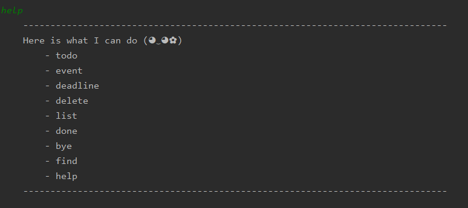

# User Guide

## Features 

### View help
Shows the entire command list of Duke. 

### Add todo task
Adds a todo task.
 
### Add event task
Adds a event task.
 
### Add deadline task
Adds a deadline task.
 
### View list
Shows a list of task that has been added previously.
 
### Mark as done
Mark a specific task as done. 
 
### Find specific task
Finds a task by searching for a keyword. 

## Usage

### `help` - Prints the entire list of command.

List all commands that can be executed on the application

Example of usage: 

`help`

Expected outcome:

 

### `help` - Prints the entire list of command.

Describe action and its outcome.

Example of usage: 

`keyword (optional arguments)`

Expected outcome:

`outcome`

### `help` - Prints the entire list of command.

Describe action and its outcome.

Example of usage: 

`keyword (optional arguments)`

Expected outcome:

`outcome`

### `help` - Prints the entire list of command.

Describe action and its outcome.

Example of usage: 

`keyword (optional arguments)`

Expected outcome:

`outcome`

### `help` - Prints the entire list of command.

Describe action and its outcome.

Example of usage: 

`keyword (optional arguments)`

Expected outcome:

`outcome`
