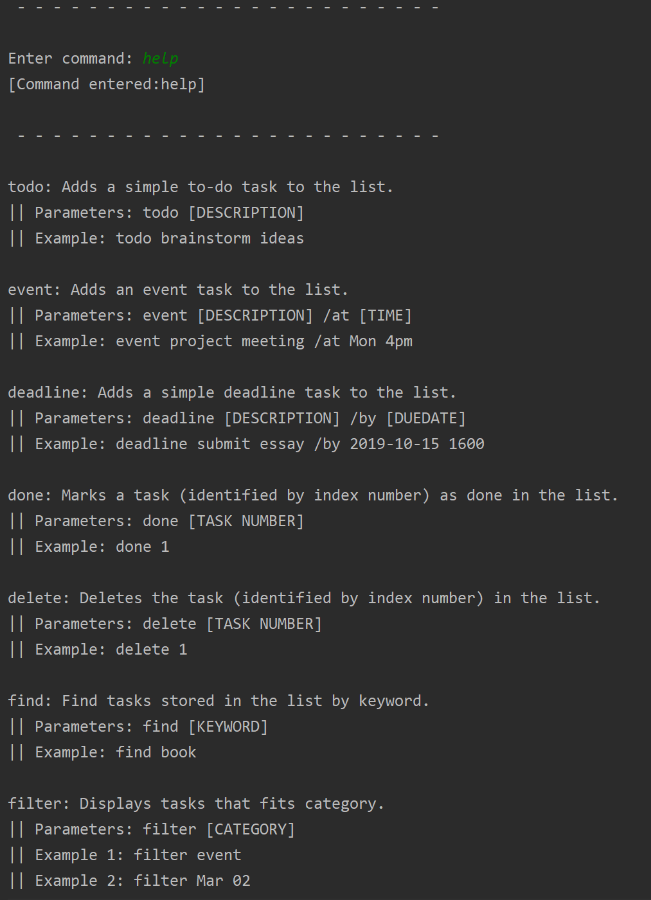

# Duke - User Guide

## Features 
1.Keep track of tasks

  Duke keep tracks of your Tasks and displays them. You can add Tasks such as Deadline, Event and ToDo.
  
2.Completing Task

  Duke allows you to marked a certain task as completed by using the `done` command.
  
3.Deleting tasks

  Duke allows you to delete certain task by using`delete` command.
  
4.Finding tasks

  Duke allows you to find certain task by using `find` command.
  
5.Auto-save and stores our tasks

  Duke auto-saves your progress and allow you to continue the next time you run it.
  
### Commands
+ [Deadline](#deadline)
+ [Event](#event)
+ [ToDo](#todo)
+ [List](#list) 
+ [Done](#done)
+ [Delete](#delete)
+ [Find](#find)
+ [Help](#help)
+ [Bye](#bye)

### Command Format
Words enclosed by `<` and `>` are parameters that are supplied by you.

## Setting Up
1. Extract the jar folder into an empty folder
2. Enter your preferred terminal and move to the location of the folder
3. Run the Command-Line interface(CLI) with `java -jar Duke.jar` in your terminal

## Usage
####  `deadline` - Adds a Deadline Task to your Task List

Syntax:

`deadline 
 /by <date/time>`

Example of usage: 

`deadline finish A-UserGuide /by March 2nd 2020`

Expected Outcome:

`Got it. I've added this task: <item details>. Now you have <amount> tasks in list.`

####  `event` - Adds a Event Task to your Task List

Syntax:

`event 
 /at <location>`

Example of usage: 

`event submit A-UserGuide /at GitHub`

Expected Outcome:

`Got it. I've added this task: <item details>. Now you have <amount> tasks in list.`

####  `todo` - Adds a ToDo Task to your Task List

Syntax:

`todo 
`

Example of usage: 

`todo Eat Lunch`

Expected Outcome:

`Got it. I've added this task: <item details>. Now you have <amount> tasks in list.`

####  `list` - List displays all the task you have added to your Task List

Syntax:

`list`

Example of usage: 

`list`

Expected Outcome:

`Here are the tasks in your list: <item details>`

####  `done` - Done marks your task as complete

Syntax:

`done <item number>`

Example of usage: 

`done 2`

Expected Outcome:

`Nice! I've marked this ask as done: <item details>`

####  `delete` - Delete your tasks from Task List

Syntax:

`delete <item number>`

Example of usage: 

`delete 2`

Expected Outcome:

`Noted. I've removed this task: <item details>`

####  `find` - Find allows you to find task from Task list based on keyword

Syntax:

`find <keyword>`

Example of usage: 

`find lunch`

Expected Outcome:

`Here are the matching tasks in your list: <item details>`

####  `help` - Help displays all function

Syntax:

`help`

Example of usage: 

`help`

Expected Outcome:

`Here is a list of command: <command details>`

####  `bye` - Bye exits the program

Syntax:

`bye`

Example of usage: 

`bye`

Expected Outcome:

`Bye. Hope to see you again soon!`

